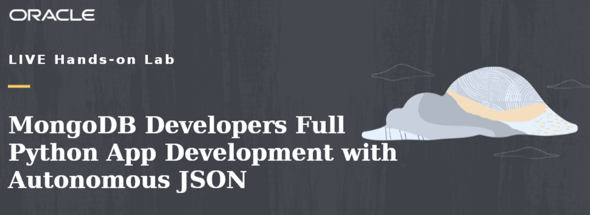

# MongoDB Developers Full Python App Development with Autonomous JSON

## Introduction

This workshop has two parts:

- Python SODA micro-service with Autonomous Database for JSON
- Python micro-service with Oracle Autonomous and MongoDB

SODA for Python is a Python API that implements Simple Oracle Document Access (SODA). It is part of the Oracle Python driver, cx_Oracle — no additional installation is needed.

You can use SODA for Python to perform create, read (retrieve), update, and delete (CRUD) operations on documents of any kind, and you can use it to query JSON documents.

SODA is a set of NoSQL-style APIs that let you create and store collections of documents (in particular JSON) in Oracle Database, retrieve them, and query them, without needing to know Structured Query Language (SQL) or how the documents are stored in the database.

Oracle Autonomous JSON Database (AJD) is a new service in Autonomous Database family for JSON-centric development. Autonomous JSON Database is built for developers who are looking for an easy to use, cost-effective JSON database with native Document API support. Autonomous JSON Database provides all the core capabilities of a document store along with high performance, simple elasticity, full ACID support and complete SQL functionality.

Learn why customers choose Oracle Autonomous JSON Database over MongoDB Atlas. Autonomous JSON Database provides all the core capabilities of MongoDB along with high performance, simple elasticity, full ACID support and complete SQL functionality.

**Estimated Workshop Time: 120 minutes.**

## Objectives
In this lab, you will:
* Create development environment on Oracle Cloud Infrastructure
* Deploy a document store with one collection on Oracle Autonomous Database for JSON
* Develop a simple Python web service to manage JSON documents via REST calls
* Use APEX to visualize document store in a very fast way
* Use multi-cloud support to your Python web service to support MongoDB
* Compare Oracle SODA with MongoDB API

## Prerequisites
* An Oracle Free Tier, Always Free, Paid or LiveLabs Cloud Account - You can check Getting Started section for more information.
* MongoDB Cloud account (or Google account)
* Deploy Atlas document store on MongoDB Cloud before the workshop

Here is a video to help with the Oracle Trial Sign Up Process:

*At this point, you are ready to start learning! Please proceed.*

## Acknowledgements
* **Author** - Valentin Leonard Tabacaru, Database Product Management
* **Contributors** - Priscila Iruela, Technology Product Strategy Director
* **Last Updated By/Date** - Priscila Iruela, March 2022

## Need Help?
Please submit feedback or ask for help using our [LiveLabs Support Forum](https://community.oracle.com/tech/developers/categories/livelabsdiscussions). Please click the **Log In** button and login using your Oracle Account. Click the **Ask A Question** button to the left to start a *New Discussion* or *Ask a Question*.  Please include your workshop name and lab name.  You can also include screenshots and attach files.  Engage directly with the author of the workshop.

If you do not have an Oracle Account, click [here](https://profile.oracle.com/myprofile/account/create-account.jspx) to create one.