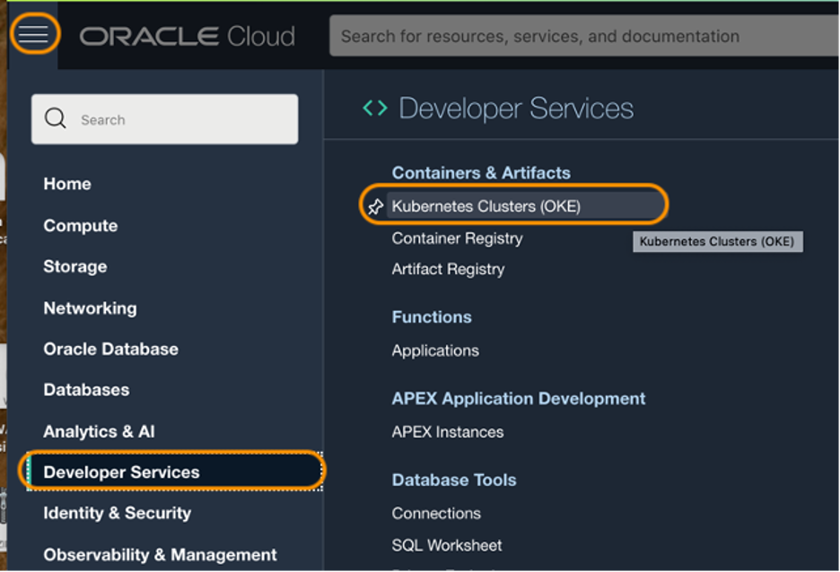
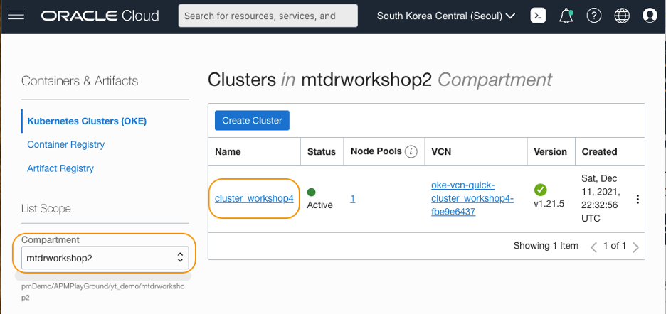
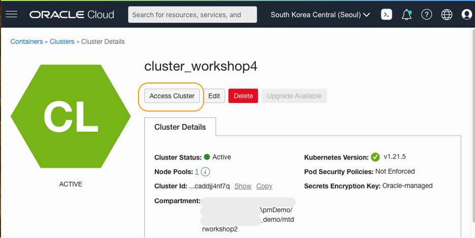
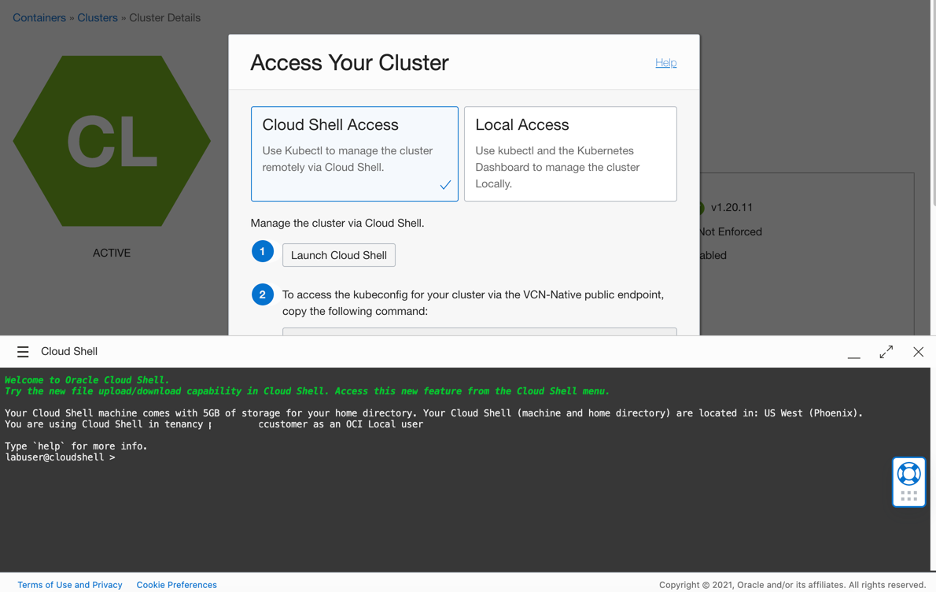

# Verify WebLogic in Kubernetes (OKE)

## Introduction

The tutorials in this workshop assume you have performed the prerequisite tasks detailed in the Introduction section of this workshop.  You’ve already created an OKE cluster in the Oracle Cloud and provisioned a WebLogic domain using the WebLogic Kubernetes Operator. If you have not done that yet, please complete **[Migrating WebLogic Server to Kubernetes on OCI](https://apexapps.oracle.com/pls/apex/dbpm/r/livelabs/view-workshop?wid=567)** workshop prior to starting Tutorial 1. The tutorials also assume you have set up EM in the Oracle Cloud, in a separate VCN.

Estimated time: 5 minutes


### Prerequisites

* Completion of the **[Migrating WebLogic Server to Kubernetes on OCI](https://apexapps.oracle.com/pls/apex/dbpm/r/livelabs/view-workshop?wid=567)** workshop, labs 1, 2, 3 and 4.


## Task 1: Verify Kubernetes services

1. Click the navigation icon at the top left corner (three bars) in the Oracle Cloud console, drop down the menu, navigate and choose **Developer Services** > **Kubernetes Clusters (OKE)**.

   

2. Locate the compartment you created the Kubernetes cluster when you performed the prerequisite **[Migrating WebLogic Server to Kubernetes on OCI](https://apexapps.oracle.com/pls/apex/dbpm/r/livelabs/workshop-attendee-2?p210_workshop_id=567&p210_type=2&session=102696148940850)** workshop. Then click the name of the cluster.

   

3.	On the Cluster Details page, click the **Access Cluster** button.

   

4.	Select **Cloud Shell Access**, then click **Launch Cloud Shell**.

   

5.	Look at the bottom of the page, and you will see a Cloud Shell window and command prompt ready for input.

   

6.	In the **Access Your Cluster** page that is still opened at the upper side of the console, locate the textbox with the OCI command, and click **Copy**.

   

7.	Paste the command into the Cloud Shell and execute. It configures the Cloud Shell session to work with the cluster.

   


   > **NOTE:**  Save the command to a text file on your laptop, and execute it every time when you start a new Cloud Shell session, while performing the tutorials in this workshop.


8.	In the Cloud Shell, run the following command.

    ``` bash
    <copy>
    kubectl get svc --all-namespaces
    </copy>
    ```

   The output will be similar to the image below. The namespace of the WebLogic Server services used in the WebLogic workshop is ***sample-domain1-ns*** by default.

   


9.	Within the same command output, locate the LoadBalancer service named **treafik-operator** in the last row. Note down the External-IP. You will need this value in the next task.

   

## Task 2: Verify WebLogic Administration Console in a browser


1.	On your computer, open a new browser tab and access the application with the following URL pattern:

     ``` bash
     <copy>
     http://<External IP of the Traefik load balancer>/console
     </copy>
     ```
     * Username: weblogic
     * Password: Password generated in the  **[Migrating WebLogic Server to Kubernetes on OCI](https://apexapps.oracle.com/pls/apex/dbpm/r/livelabs/view-workshop?wid=567)** workshop, Lab 4, Step 1

     Make sure the WebLogic Administration console login page launches in the new browser tab like the image below.

     


      >**NOTE:** If you can’t start the application, return to the prerequisite workshop, **[Migrating WebLogic Server to Kubernetes on OCI](https://apexapps.oracle.com/pls/apex/dbpm/r/livelabs/workshop-attendee-2?p210_workshop_id=567&p210_type=2&session=102696148940850)** and validate Lab 1 through Lab 4 were performed.


You may now [proceed to the next tutorial](#next).

## Acknowledgements

* **Author** - Yutaka Takatsu, Product Manager, Enterprise and Cloud Manageability
- **Contributors** -
Steven Lemme, Senior Principal Product Manager,  
Mahesh Sharma, Consulting Member of Technical Staff,  
Avi Huber, Senior Director, Product Management
* **Last Updated By/Date** - Yutaka Takatsu, March 2022
