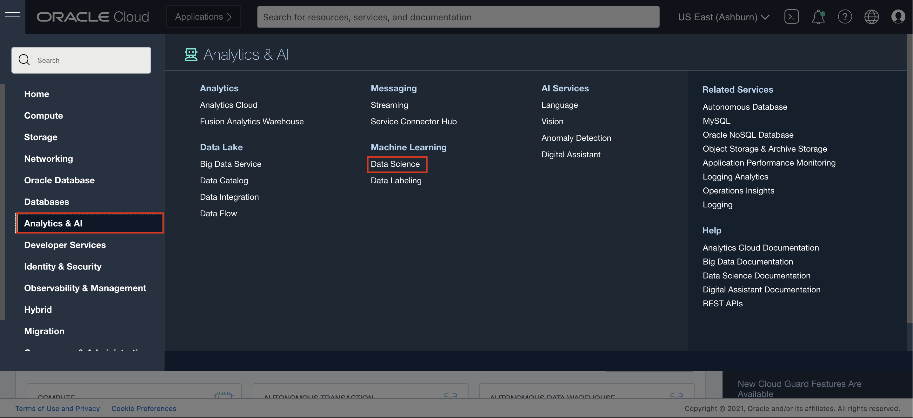
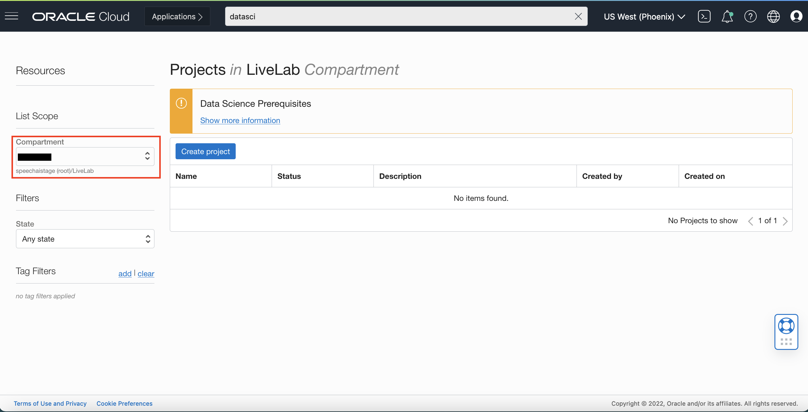
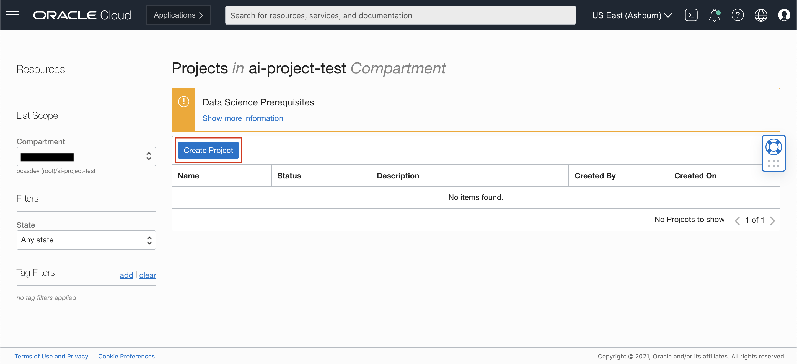
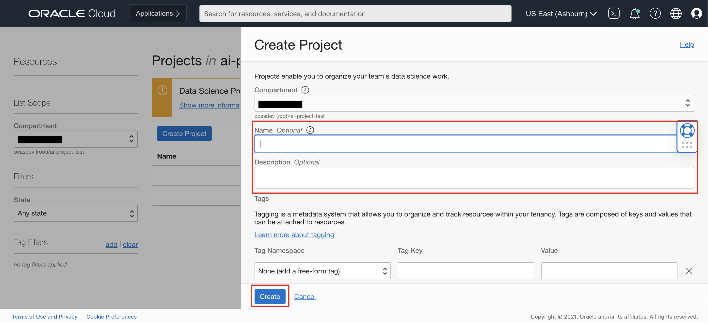
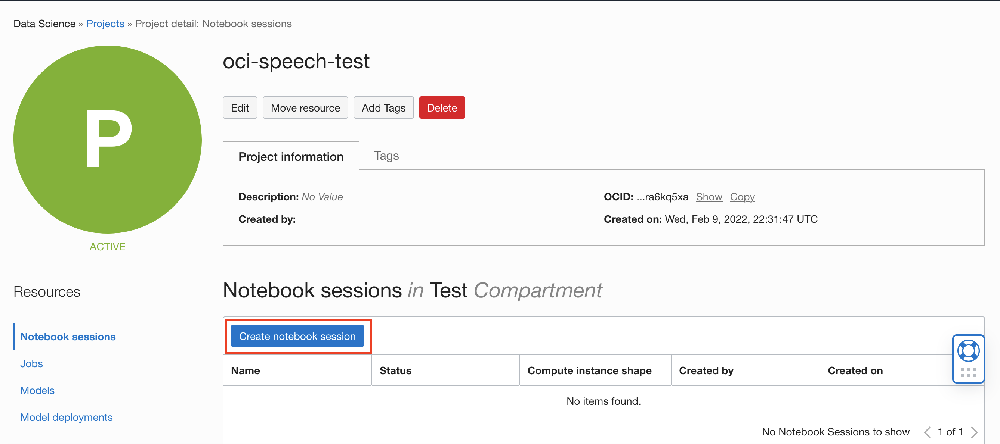
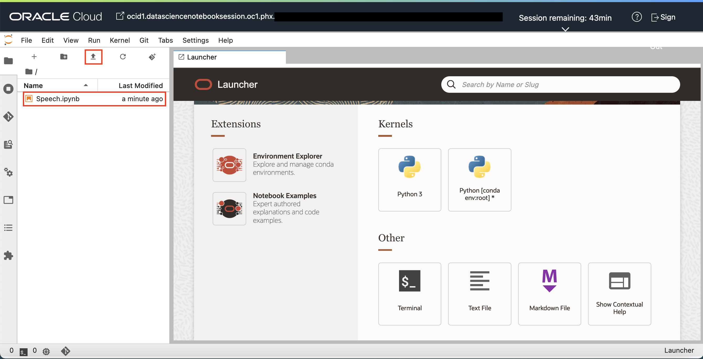
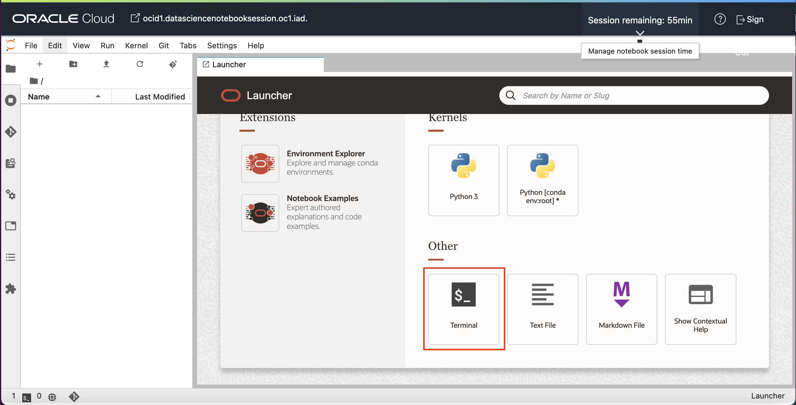

# Lab 5: Use OCI speech with datascience notebook session

## Introduction

In this lab session, we will show you how to access OCI Speech services in a DataScience Notebook.

The Datascience Notebook is a web application that contains code, results and visualizations that makes testing and sharing ML pipelines simple.

*Estimated Lab Time*: 15 minutes

### Objectives:
* Learn how to use Speech Services within a DataScience notebook.

## **Data Science Prerequisites** 

Before you can start using Data Science, your tenancy administrator should set up the following networking, dynamic group, and policies.

1. Create VCN and Subnets

    Create a VCN and subnets using Virtual Cloud Networks > Start VCN Wizard > VCN with Internet Connectivity option.
    The Networking Quickstart option automatically creates the necessary private subnet with a NAT gateway.

2. Create Dynamic Group

    Create a dynamic group with the following matching rule:
    ALL { resource.type = 'datasciencenotebooksession' }

3. Create Policies

    Create a policy in the root compartment with the following statements:

    3.1 Service Policies
        ```
        <copy>allow service datascience to use virtual-network-family in tenancy</copy>
        ```

    3.2 Non-Administrator User Policies
        ```
        <copy>
        allow group <data-scientists> to use virtual-network-family in tenancy
        </copy>
        ```
        ```
        <copy>
        allow group <data-scientists> to manage data-science-family in tenancy
        </copy>
        ```

    where data-scientists represents the name of your user group.

    3.3 Dynamic Group Policies
        ```
        <copy>allow dynamic-group <dynamic-group> to manage data-science-family in tenancy</copy>
        ```

    where dynamic-group represents the name of your dynamic group.

## **Task 1:** Navigate to the Data Science Notebook Session

Follow the below steps to open Notebook in DataScience:
1. Navigate to Data Science Service

    Log into OCI Cloud Console. Using the Burger Menu on the top left corner, navigate to Analytics and AI menu and click it, and then select Data Science item under Machine Learning.
        

2. Select Compartment

    Select the Compartment in which want to create your project.
        
<!-- Click Create Project to create a new project. -->
<!-- Select the Root Compartment -->
    

3. Create Project

    Click Create Project to create a new project.
        
<!-- Select the Project named 'oci-Speech-livelabs' -->
    

4. Enter Project Details

    Enter name and click Create Button.
        
<!-- Select the Notebook named 'Livelabs Notebook' -->
    


5. Create Notebook Session

    Click Create Notebook Session to create a new Notebook session.
        

6. Enter Notebook Details

    Select a name.
    We recommend you choose VM.Standard2.8 (not VM.Standard.E2.8) as the shape. This is a high performance shape, which will be useful for tasks such as AutoML.
    Set block storage to 50 GB.
    Select the subnet with Internet connectivity. (Select private subnet if you have use VCN Wizard to create VCN)
        

7. Open the OCI Data Science notebook

    The Notebook Session VM will be created. This might take a few minutes. When created you will see a screen like the following.
    Open the notebook session that was provisioned.
        

## **Task 2:** Invoke the Speech Service


1. Download and Upload the Files

    Download this [Speech Notebook](./files/speech.ipynb) and upload to notebook session
        

2. Setup API Signing Key and Config File

    Open the Terminal by clicking the Terminal icon in the Launcher Tab.
        

    In the terminal, create a .oci directory in the Data Science notebook session.
        ```
        <copy>mkdir ~/.oci</copy>
        ```

    Upload the Config file and the Private Key to the Notebook Session by clicking on the Upload Files Icon you just created in Lab 3 (Setup API Signing Key and Config File.)

    In the terminal, move those files to the .oci folder.
        ```
        <copy>mv <path of the config file> ~/.oci/</copy>
        ```
        ```
        <copy>mv <path of the private key> ~/.oci/</copy>
        ```
        
    To Know more about about how to create API Key and config file, Refer Lab-3 (Setup API Signing Key and Config File).
        

3. Execute the Notebooks

    Open the Notebook that you've just uploaded

    Now go through each of the cells and run them one by one. You can click Shift+Enter on each cell to run the code in the cell.

    This notebook should allow you to individually run the various OCI speech service commands and view their outputs

Congratulations on completing this lab!

You may now **proceed to the next lab**

## Acknowledgements
* **Authors**
    * Alex Ginella - Oracle AI Services
    * Rajat Chawla  - Oracle AI Services
    * Ankit Tyagi -  Oracle AI Services
